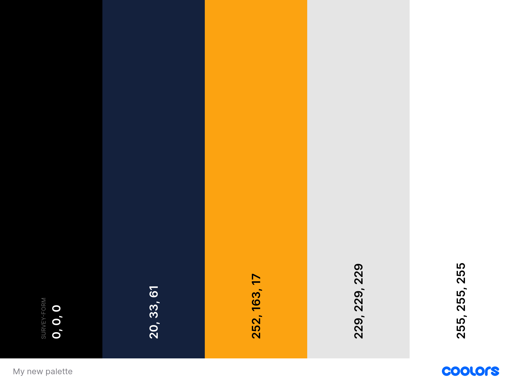

Survey-form/h1>

Survey-form is a simple form made in html and css

<h2>How to use</h2>

Download the files and open index.html in your browser

<h2>Preview</h2>

<h2>Contributing</h2>

Pull requests are welcome. For major changes, please open an issue first to discuss what you would like to
    change.

Please make sure to update tests as appropriate.

<h2>License</h2>

MIT

<h2>Author</h2>

Vishvadeep Singh Chauhan

<h2>Project status</h2>

Completed

<h2>Live preview</h2>
<a href="https://vishvadeepsingh.github.io/Survey_form/">Survey-form</a>
<h2>Code preview</h2>
<a href=".index.html">click Here!</a>

<h3> This favicon was generated using the following font:</h3>

- Font Title: Lekton

- Font License: SIL Open Font License, 1.1 (http://scripts.sil.org/OFL))</h1>
- Font License URL: http://scripts.sil.org/OFL</h1>
- Font License Description: SIL Open Font License, 1.1 (http://scripts.sil.org/OFL)
- Font License Copyright: Copyright (c) 2008, 2009, 2010, Accademia di Belle Arti di Urbino
(luciano.perondi@isiaurbino.net). Licensed under the SIL</h1>
Open Font License, Version 1.1</h1>

<h3>colors:- SCSS RGB </h3>

-$black: rgba(0, 0, 0, 1);</h1>
-$oxford-blue: rgba(20, 33, 61, 1);</h1>
-$orange-web: rgba(252, 163, 17, 1);</h1>
-$platinum: rgba(229, 229, 229, 1);</h1>
-$white: rgba(255, 255, 255, 1);</h1>
